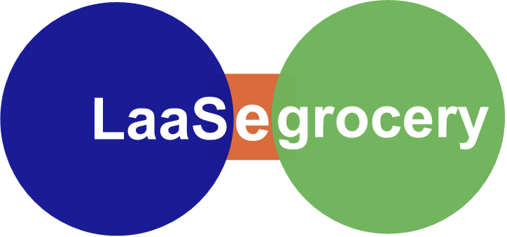
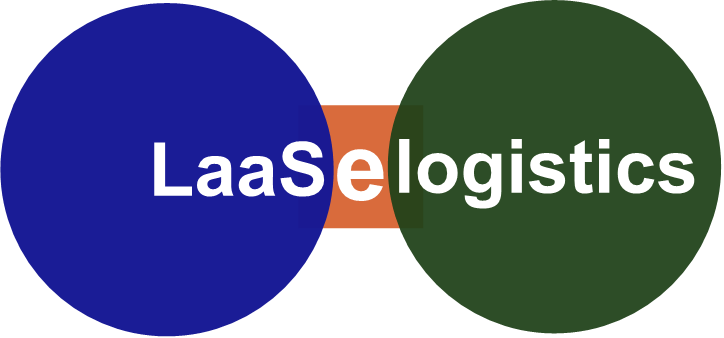

# Laastras project

Since each person will ultimately own a cell phone, named “HoFi (Home Finances)”, 
Laastras organization harnesses the power 
behind software technologies to guarantee your share on all resources that support human existence
in your country, first, and then, in the world. Our country and the world become an enterprise in which all of us
citizens have equal shares. Our major brands are: 

## “LaasEgrocery” (nutrition)

## “LaasEcard” (a cell phone named HoFi, i.e., Home Finances)

## “LaasElogistics”

## “LaasEalliances”

## “LaasEmorshux”

